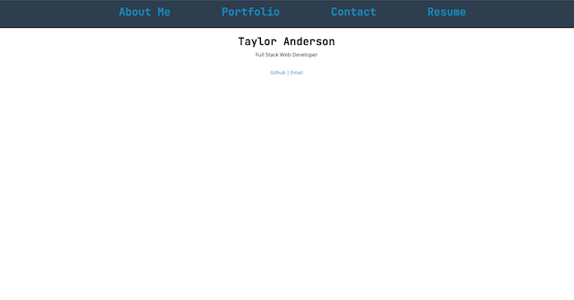

# Portfolio

## Table of Contents
  
1. [Description](#description)
2. [Usage](#usage)
3. [License](#license)
4. [Test Instructions](#test-instructions)
5. [Questions](#questions)
  
## Description

* My portfolio
  

## Usage

[Deployment](https://newengood.com/)

## License
  
* MIT

## Test Instructions

* Fork the repository, create tests, submit an issue.
  
## Questions

* Contact information for questions:

* 04-scones.card@newengood.com

  
  
